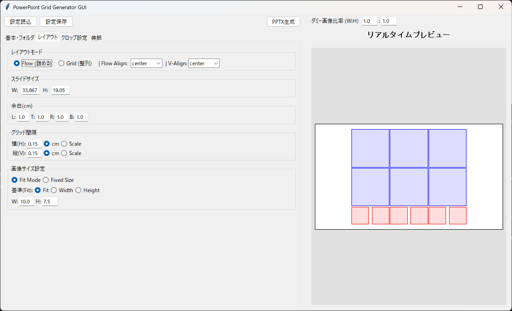
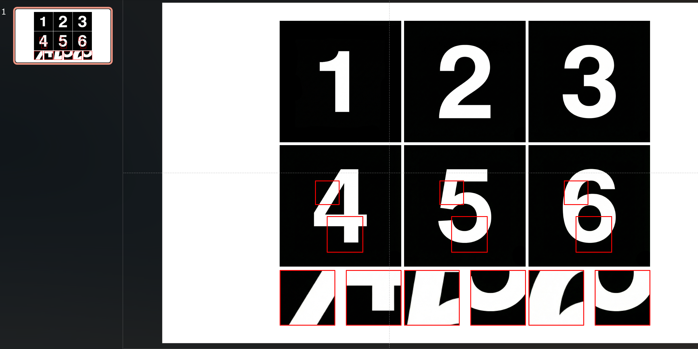

# pptx-image-align


Example of GUI


Example of output.pptx

複数の画像を PowerPoint（.pptx）上に「グリッド整列」または「フロー（詰め）配置」で並べて出力するツールです。
GUI でプレビューしながら調整するか、YAML 設定ファイルを使って CLI で一括生成できます。

- CLI: [cli.py](cli.py)
- GUI: [gui.py](gui.py)
- 共通ロジック: [core.py](core.py)

---

## できること（実装ベース）

### レイアウト

- スライドサイズ（cm）指定
- rows×cols のグリッド
- レイアウトモード
  - grid: 各セルに整列
- flow: 行/列の“中身の実寸”で詰める（左右揃え・上下揃え・軸指定対応）
- 余白（margin）、間隔（gap）
  - gap は cm 固定または scale（参照サイズ×倍率）

### 入力

- フォルダ入力（folder mode）
  - 画像はファイル名中の数字でソート（例: 1.png, 2.png, 10.png）
  - arrangement: row/col（フォルダが行になるか列になるか）
- 画像リスト入力（images mode）
  - row-major（左→右、上→下）順にパスを並べる
  - 空セルを作りたい場合は __PLACEHOLDER__ を入れる（CLI/YAML でも GUI でも利用）

対応画像形式: .png / .jpg / .jpeg / .gif / .bmp / .tiff / .webp

### クロップ（拡大表示）

- 1 枚の画像に複数のクロップ領域（CropRegion）を定義
- 座標指定
  - px: x/y/width/height をピクセルで指定
  - ratio: x_ratio/y_ratio/width_ratio/height_ratio を 0.0〜1.0 で指定（画像サイズ差に強い）
- 表示
  - position: right / bottom
  - size（cm）または scale（メイン画像に対する倍率）
  - 各領域ごとに align/offset/gap を個別指定
  - show_zoomed: false にすると「枠線だけ（拡大画像は出さない）」が可能
- 適用セルの制御（YAML/CLI 向け）
  - crop.rows / crop.cols（0-index、null は全て）
  - crop.targets（行・列の明示指定）
  - crop.overrides（セル単位の上書き/無効化）

### 装飾

- クロップ枠線（元画像上）/ 拡大画像枠線（pt、rectangle/rounded）
- クロップ枠と拡大画像を結ぶ連結線（connector）
  - dash_style: solid / dash / dot
  - 注意: 現状は直線のみ（connector.style は将来用）

### ラベル（キャプション）

- 画像の上下にテキストを配置
- filename / number（連番）/ custom（任意テキスト配列）

### テンプレート PPTX

- template.path を指定すると、その PPTX をベースに 1 スライド追加して描画
- template.layout_index で使用レイアウトを選択（既定 6=白紙）

### CLI バッチ処理

- 単一 YAML から生成
- 複数 YAML を一括処理（--batch / --batch-dir / --batch-output）

---

## 必要環境

- Python >= 3.10
- 依存関係: [pyproject.toml](pyproject.toml)
  - python-pptx（PPTX 生成）
  - pillow（画像処理 / GUI）
  - pyyaml（設定ファイル）

---

## インストール

### uv（推奨）

```sh
uv sync
```

### pip（代替）

```sh
python -m pip install -U pip
python -m pip install .
```

---

## 使い方（GUI）

起動:

```sh
uv run python gui.py
```

設定ファイルを指定して起動:

```sh
uv run python gui.py config.yaml
```

GUI では、入力（フォルダ/画像リスト）・レイアウト調整・クロップ領域作成（Crop Editor）・設定保存・PPTX 生成ができます。

---

## 使い方（CLI）

### ヘルプ

```sh
uv run python cli.py --help
```

### サンプル設定ファイルを生成

```sh
uv run python cli.py --init config.yaml
```

### YAML から PPTX を生成

```sh
uv run python cli.py config.yaml
```

### バッチ処理

```sh
uv run python cli.py --batch a.yaml b.yaml c.yaml
```

```sh
uv run python cli.py --batch-dir ./configs
```

```sh
uv run python cli.py --batch-output ./out a.yaml b.yaml
```

### グリッドサイズの自動推定（CLI）

CLI は folders が指定されている場合、rows/cols が 0 のときにフォルダ構造から推定します。

- arrangement=row の場合: rows=フォルダ数、cols=各フォルダ内の最大画像数
- arrangement=col の場合: cols=フォルダ数、rows=各フォルダ内の最大画像数

---

## 入力フォルダ構造と並び順

folders に列挙したフォルダから画像を読み込み、ファイル名中の数字でソートします（core.get_sorted_images）。

例（本リポジトリ同梱）:

```text
images/
  row1/
  row2/
```

- grid.arrangement=row の場合：各フォルダが「行」
- grid.arrangement=col の場合：各フォルダが「列」

---

## 設定ファイル（YAML）

サンプル: [config.yaml](config.yaml)

### 主要項目（抜粋）

| カテゴリ       | 項目                                            | 説明                                          |
| -------------- | ----------------------------------------------- | --------------------------------------------- |
| slide          | width / height                                  | スライドサイズ（cm）                          |
| grid           | rows / cols                                     | グリッドサイズ（CLI では 0 指定で自動推定可） |
| grid           | arrangement                                     | row / col                                     |
| grid           | layout_mode                                     | grid / flow                                   |
| grid           | flow_align                                      | left / center / right（flow のみ）            |
| grid           | flow_vertical_align                             | top / center / bottom（flow のみ）            |
| grid           | flow_axis                                       | both / horizontal / vertical（flow のみ）     |
| margin         | left/top/right/bottom                           | 余白（cm）                                    |
| gap            | horizontal/vertical                             | 間隔（数値=cm、または {value, mode}）         |
| image          | size_mode                                       | fit / fixed                                   |
| image          | fit_mode                                        | fit / width / height                          |
| image          | width/height                                    | 固定サイズ（size_mode=fixed のとき）          |
| image          | scale                                           | 画像スケール（現状は未使用・将来用）          |
| crop           | regions                                         | クロップ領域の配列                            |
| crop.regions[] | mode                                            | px / ratio                                    |
| crop.regions[] | x/y/width/height                                | px 指定時（ピクセル）                         |
| crop.regions[] | x_ratio/...                                     | ratio 指定時（0.0〜1.0）                      |
| crop.regions[] | show_zoomed                                     | false で「枠のみ」                            |
| crop           | rows/cols                                       | 適用行/列（0-index、null は全て）             |
| crop           | targets                                         | 適用セル明示指定（例: [{row:0,col:1}]）       |
| crop           | overrides                                       | セル単位の上書き（空リストで無効化）          |
| crop.display   | position                                        | right / bottom                                |
| crop.display   | size / scale                                    | 拡大画像サイズ（cm / 倍率）                   |
| crop.display   | main_crop_gap / crop_crop_gap / crop_bottom_gap | 間隔（cm/scale）                              |
| border         | crop / zoom                                     | 枠線設定（show/width/shape）                  |
| label          | enabled/mode/...                                | ラベル設定（filename/number/custom）          |
| template       | path / layout_index                             | テンプレート PPTX とレイアウト番号            |
| connector      | show/width/color/dash_style                     | 連結線設定（style は現状未使用）              |
| folders        | -                                               | 入力フォルダ一覧                              |
| images         | -                                               | 画像パス一覧（row-major、__PLACEHOLDER__ 可） |
| output         | -                                               | 出力 pptx パス                                |

---

## クロッププリセット

GUI の「クロッププリセット」は、ビルトインプリセット + crop_presets.yaml（任意）を読み込みます。

- 保存先: crop_presets.yaml（作業ディレクトリ）
- 形式: presets: の配列（name/description/display_position/regions）

---

## アーキテクチャ（概要）

```text
┌─────────────┐     ┌─────────────┐
│   gui.py    │     │   cli.py    │
│  (tkinter)  │     │   (argv)    │
└──────┬──────┘     └──────┬──────┘
       │                   │
       └─────────┬─────────┘
                 ▼
              core.py
   (設定ロード/保存、レイアウト計算、PPTX出力)
```

---

## ライセンス

MIT License（[LICENSE](LICENSE)）
